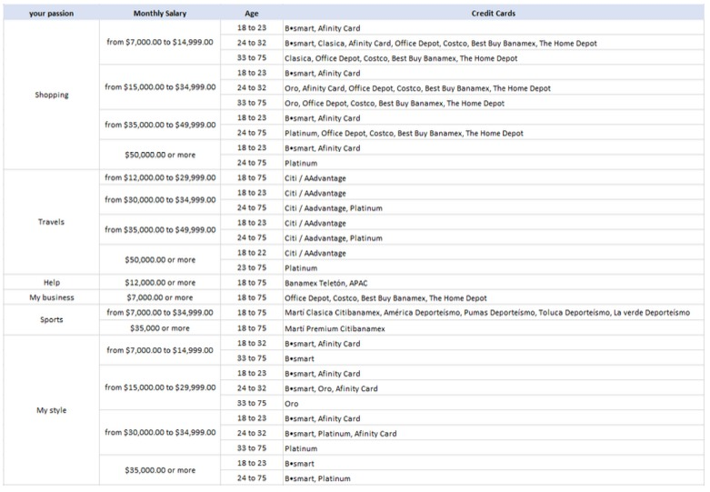
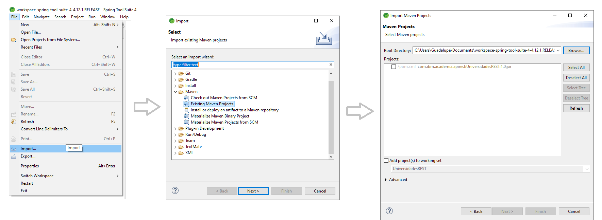
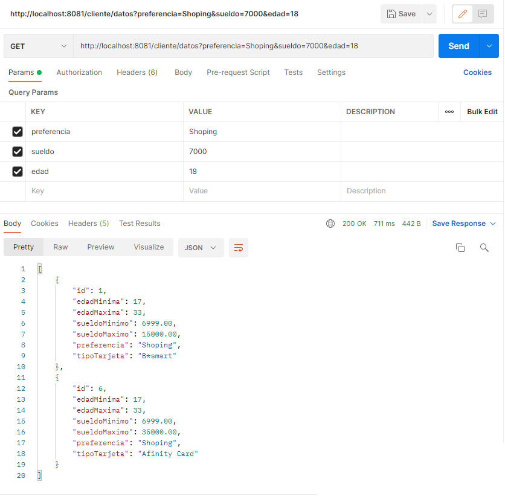
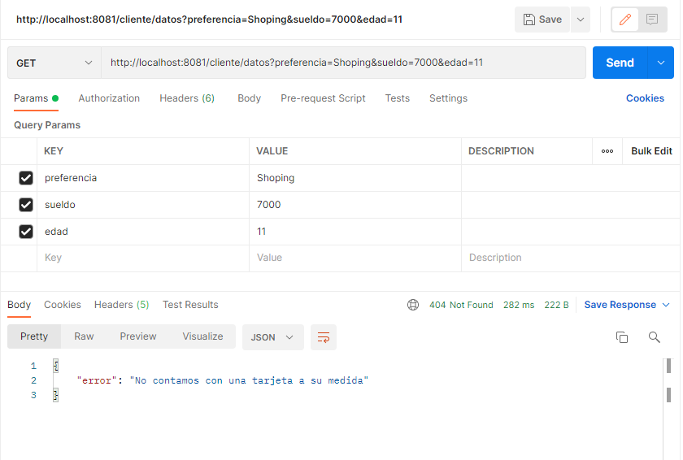

### Caso Practico
Construir un Micro Servicio \ API donde el usuario o sistema pasa la información para definir el perfil de tarjetas de crédito, de acuerdo con el cuadro siguiente:

Esta aplicación és responsable de obtener el tipo de tarjeta de crédito más adecuado para el cliente basado en su perfil. Los datos de perfil que el usuario capturará son los siguientes:

Input:
- Preferencias (Your passion)
- Salario (Monthly salary)
- Edad (Age)

OutPut
- Tipo de tarjeta

# TarjetasREST
Paso a paso para ejecutar la aplicación:

1. No es necesario instalar una base de datos como PostgreSQL, este proyecto cuenta con una base de datos en memoria

2. Clonar y descargar el presente proyecto:
- https://github.com/Guadalupe-Moreno/TarjetasREST.git

3. Importar el proyecto como MAVEN en la IDE spring tool suite, eclipse o intellij, 
**se debe tener instalada la librería lombook**

4. Ejecutar el proyecto **run as spring boot app**

5. Probrar el siguiente **end-point** en la aplicacion de postman o en alguna otra similar.
- http://localhost:8081/cliente/datos

**Es necesario ingresar por parametro los datos de la siguiente manera:**

**De no haver considencia con la base de datos:**

****